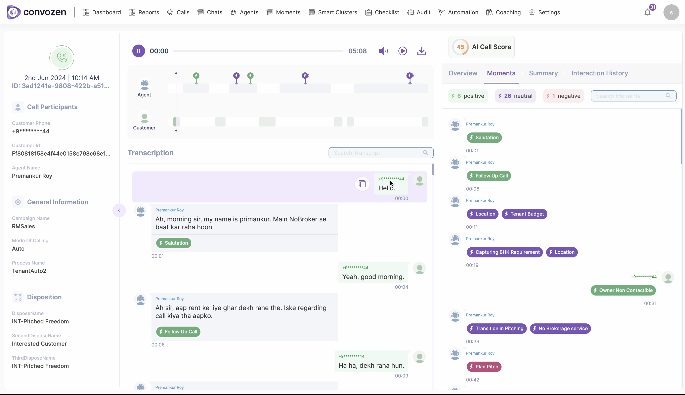

# 🤖 ConvoZenDemo

ConvoZen.AI delivers a comprehensive AI-powered conversational platform, enabling businesses to transform their customer interactions through advanced Natural Language Processing (NLP) and machine learning. 🚀

With ConvoZen.AI, businesses can automate customer engagement across various channels, including chat 💬, voice 🗣️, email 📧, and social media 📱, ensuring faster response times and consistent, high-quality service.

A standout feature is the Multilingual VoiceBot 🌐🎙️, which handles voice interactions in multiple languages with high accuracy. This allows businesses to offer voice-based customer support in English, regional Indian languages, and other global languages. By using speech recognition and synthesis technologies, the VoiceBot offers human-like interactions, making it ideal for industries such as banking 🏦, healthcare 🏥, and e-commerce 🛒 where voice communication is key.

ConvoZen.AI's intelligent chatbots and virtual assistants provide personalized, context-aware responses, improving customer engagement and satisfaction. 😊 The platform integrates with CRM systems to track interactions, gather insights, and optimize performance. 📊

With multilingual support, ConvoZen.AI ensures culturally appropriate responses, making it perfect for businesses expanding into new markets or supporting diverse customer groups. 🌍

ConvoZen.AI also offers powerful data analytics tools to analyze customer interactions and provide actionable insights. 📈 Built with scalability, privacy, and security in mind 🔒, the platform handles large query volumes while maintaining compliance with industry standards.

By focusing on automation, personalization, and multilingual capabilities, ConvoZen.AI empowers businesses to elevate customer experience, streamline processes, and drive growth. 💼📈

## 🎥 Demo Video

Click the image below to watch the demo video:

*Note: Click the image to download and view the video.*

## 🎙️ Voice Bot Demo

Listen to our Human-like AI driven voice bot in action:

[Listen to Voice Bot Demo](./ConvoZen.AI_voice_bot_demo.mp3)
